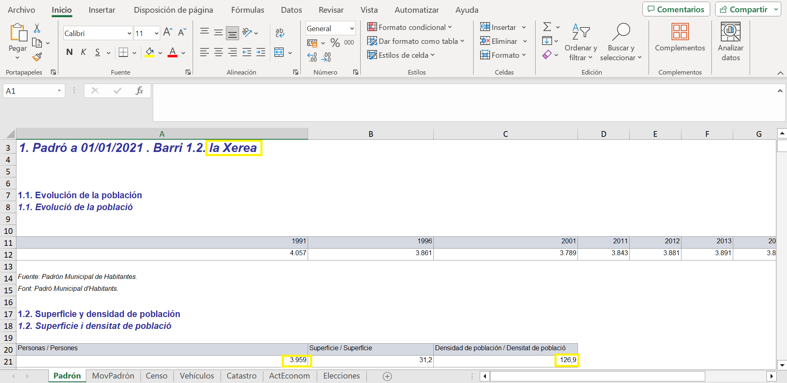

```{r setup, cache = F, echo = F, message = F, warning = F, tidy = F}
rm(list=ls())
# CONFIGURACIÓN GENERAL
library(knitr)
options(width = 100)
# Opciones generales chunks
knitr::opts_chunk$set(
	echo = TRUE,
	error = F,
	fig.align = "center",
	fig.path = "./figure/",
	message = FALSE,
	warning = FALSE,
	cache.path = ".cache/",
	comment = NA,
	dpi = 100,
	tidy = F
)
#options(xtable.type = 'html')
knit_hooks$set(inline = function(x) {
  
  if(is.numeric(x)) {
    round(x, getOption('digits'))
  } else {
    paste(as.character(x), collapse = ', ')
  }
})
#knit_hooks$set(plot = knitr:::hook_plot_html)
```

# Carga de librerías

```{r}
library(pacman)
packages = c("MASS","knitr","tidyverse","car",'dplyr','kableExtra',"tidyr","readr","magrittr","VIM","GGally","igraph","ggplot2","sf","leaflet","webshot2","ggmosaic","corrplot","readxl","stringr","ggpubr")
pacman::p_load(char=packages)
```

# Carga de ficheros

Para crear el dataset con el que vamos a tratar en este proyecto, hemos extraido varios archivos de la [web](https://valencia.opendatasoft.com/pages/home/) del portal de datos abiertos del Ayuntamiento de Valencia. En ellos tenemos diferente información acerca de los 88 barrios que hay en Valencia, como pueden ser el número de zonas verdes, precio del alquiler, actividad comercial, renta, etc. Antes de atacar las preguntas que nuestro conjunto resolverá, vamos a cargar los datos y unirlos en un único dataset, con una variable común para todos, el barrio.

## Vulnerabilidad
El primer dataset [Vulnerabilidad](https://valencia.opendatasoft.com/explore/dataset/vulnerabilidad/table/) nos da información general del barrio, como la densidad de población, la renta media, o el estado de vulnerabilidad. Esta última variable será de gran interés en nuestro análisis posterior.

```{r}
vuln <- read_delim("./data/vulnerabilidad.csv", 
    delim = ";", escape_double = FALSE, col_types = cols(`Geo Point` = col_skip(), 
        `Geo Shape` = col_skip(), `Densitat_p` = col_skip()), 
    trim_ws = TRUE)%>%arrange(nombre)

colnames(vuln)[colnames(vuln) == "nombre"] <-"Barrio"
colnames(vuln)[colnames(vuln) == "Index_Gl_1"] <-"Indice_Vuln"


vuln$Barrio<-factor(vuln$Barrio,levels = unique(vuln$Barrio))
vuln$Indice_Vuln<-factor(vuln$Indice_Vuln,levels = c("Vulnerable","Pot. Vulnerable","No Vulnerable"))

head(vuln)
```

Podemos ver en el código que es importante transformar la variable `Barrio` en un factor, para poder graficar y tratar la información de forma adecuada. Repetiremos este proceso en cada conjunto de datos, además de poner a todos el mismo nombre para poder unirlos más adelante.

## Precio de compra y alquiler
Estos dos datasets de [compra](https://valencia.opendatasoft.com/explore/dataset/precio-de-compra-en-idealista/table/) y [alquiler](https://valencia.opendatasoft.com/explore/dataset/precio-alquiler-vivienda/table/) nos presentan informaciones similares, que es la media de precios de compra y alquiler en nuestros barrios en los años 2022 y 2010. Ya que son conjuntos muy similares, vamos a adelantarnos al próximo paso y fusionarlos en un único dataset, llamado `precios`.

```{r}
p_compra <- read_delim("./data/precio-de-compra-en-idealista.csv", 
    delim = ";", escape_double = FALSE, col_types = cols(`Geo Point` = col_skip(), 
        `Geo Shape` = col_skip(), Fecha_creacion = col_skip(),`Max_historico (Euros/m2)` = col_skip(), 
        Año_Max_Hist = col_skip()), 
    trim_ws = TRUE)%>%arrange(BARRIO)

p_compra$BARRIO<-factor(p_compra$BARRIO,levels = unique(p_compra$BARRIO))

p_alquiler <- read_delim("./data/precio-alquiler-vivienda.csv", 
    delim = ";", escape_double = FALSE, 
    trim_ws = TRUE, col_types = cols(`Geo Point` = col_skip(), `Geo Shape` = col_skip(), Fecha_creacion = col_skip(),`Max_historico (Euros/m2)` = col_skip(), 
        Año_Max_Hist = col_skip()))%>%arrange(BARRIO)

p_alquiler$BARRIO<-factor(p_alquiler$BARRIO,levels = unique(p_alquiler$BARRIO))

precios<-full_join(p_compra,p_alquiler,by="BARRIO",suffix = c(" de compra"," de alquiler"))
colnames(precios)[colnames(precios) == "BARRIO"] <-"Barrio"

head(precios)
```

## Recibos IBI
Vamos ahora con el dataset [IBI](https://valencia.opendatasoft.com/explore/dataset/rebuts-ibi-2022/table/), que nos da información de los diferentes recibos del IBI (Impuesto sobre Bienes Inmuebles) entre los años 2021 y 2023. Este conjunto nos va a dar una muy buena visión acerca de la actividad del barrio, tanto comercial como cultural, turística, religiosa, industrial, etc. 

Debido a que en ningún momento vamos a tratar con tiempo en este dataset, vamos a eliminar los años haciendo la media de las observaciones de cada barrio durante estos tres años, para así obtener tantas observaciones como barrios, ya que si no habrá conflictos a la hora de unir los datos.

```{r}
ibi <- read_delim("./data/rebuts-ibi-2022.csv", delim = ";", escape_double = FALSE, col_types = cols(ID = col_skip(), geo_shape = col_skip(), geo_point_2d = col_skip(), Año = col_skip()), trim_ws = TRUE)%>%
  arrange(Barrio)%>%
  mutate_at(vars(-all_of(c("Distrito","Barrio"))), ~as.numeric(sub(",",".",.)))

ibi$Barrio<-factor(ibi$Barrio,levels = unique(ibi$Barrio))

# Hacemos la media de las observaciones de cada barrio en los tres año y nos quitamos 2/3 de las observaciones
ibi <- ibi %>% group_by(Barrio) %>%  mutate(across(where(is.numeric), mean, na.rm=TRUE))%>%distinct()

head(ibi)
```

## Bancos por barrio
Por último, vamos con nuestro último conjunto de datos, [barrios](https://valencia.opendatasoft.com/explore/dataset/bancs-en-via-publica-bancos-en-via-publica/table/), que contiene mucha información acerca de la ubicación de las entidades bancarias en nuestra ciudad. Debido a que nosotros solo vamos a tratar con barrios y no con direcciones ni nada similar, hemos decidido que lo más interesante de este conjunto es el número de bancos que podemos encontrar en cada barrio (puede ser un buen indicador de riqueza o pobreza). Guardaremos esta información en un nuevo dataset llamado `num_bancos`.

```{r}
bancos <- read_delim("./data/bancs-en-via-publica-bancos-en-via-publica.csv", 
    delim = ";", escape_double = FALSE, col_types = cols(gid = col_skip(), 
        `Num. Policia` = col_skip(), geo_point_2d = col_skip()), 
    trim_ws = TRUE)%>%arrange(Barrio)

bancos$Barrio%<>%gsub("[0-9] - ","",.)
bancos$Barrio%<>%factor(levels = unique(bancos$Barrio))

num_bancos<-bancos%>%group_by(Barrio)%>%summarize(Num_bancos=n())
head(num_bancos)
```

## Población

Este conjunto contiene el area y la población de los diferentes barrios. Hemos considerado este dataset debido a que los datos de areas y densidad de población que nos proporcionaba el conjunto vulnerabilidad y barrios no cuadraban con nuestras búsquedas y carecían de sentido. Por ello hemos considerado este otro que se ajusta mucho mejor. Para calcular la densidad usaremos la función mutate.

Este *dataset* se trata de un directorio donde se encuentran un total de 176 archivos Excel. Dos de estos aportan información relacionada con Valencia, mientras que el resto dan información específica de cada barrio (por cada barrio hay dos archivos, uno en castellano y otro en valenciano). Por tanto, hemos creado un programa que abra uno a uno los archivos en un idioma y obtenga la información que deseamos para después guardarla en un dataframe.

Para ello, primero hemos abierto uno de los archivos Excel (ver Figura 1) y se ha estudiado como abordar el problema. Después, se ha cargado uno de ellos, y se ha buscado la manera de obtener la información referida al nombre del barrio, el área y la población del mismo (recuadros amarillos en la Figura 1). 
{withd="80%"}
*Figura 1: ejemplo de uno de los archivos Excel analizados.*

```{r eval=FALSE, include=TRUE}
#   SE HA PUESTO CON eval = FALSE PORQUE TARDA MUCHO EN CORRER
# Obtener las rutas de todos los archivos con los que se va a trabajar
archivos_barrios <- list.files(path = "./data/Barrios2022", pattern = 'Districte', full.names = TRUE)

# Creamos las listas donde vamos a guardar los datos de interés (la longitud es de 87 porque hay información sobre 87 barrios)
area <- 1:87
poblacion <- 1:87
nombre <- 1:87

# Un bucle que recorre todos los archivos que utilizaremos y extrae los datos de interés
for (i in 1:length(archivos_barrios)) {
  Barrio <- read_excel(archivos_barrios[i], sheet = "Padrón")
  fila <- grep('Padró' ,Barrio[[1]])[1]
  nombre_barrio <- Barrio[[1]][fila]
  nombre[i] <-trimws(toupper(substring(nombre_barrio, 36)))
  fila <- grep('Superficie' ,Barrio$...2)
  area[i] <- Barrio$...2[fila + 1]
  fila <- grep('Personas', Barrio[[1]])[1]
  poblacion[i] <- Barrio[[1]][fila + 1]
}

demografico <- data.frame(nombre, area, poblacion)

# Hay algunos nombres que se han guardado mal, por lo que vamos a tener que tratarlos. Vemos que todos los que estan mal comienzan por ".  " o por "[0-9].  "
for (i in 1:length(demografico$nombre)) {
  if (grepl('^[^A-Za-z]',demografico$nombre)[i]) {
    demografico$nombre[i] <- str_remove(demografico$nombre[i], "([0-9]|). ")
  }
}

# También falta el dato de un barrio, asi que hay una fila de más
demografico <- demografico[!(demografico$nombre == '88'), ]

# Vemos quales de los nombres del dataframe nuevo no están en el principal
precios$Barrio[!(demografico$nombre %in% precios$Barrio)]

# Hay que poner de la misma maera que estan en el data-frame pricipal
demografico$nombre[demografico$nombre == "GRAN VIA"] <- "LA GRAN VIA"
demografico$nombre[demografico$nombre == "EXPOSICIÓ"] <- "EXPOSICIO"
demografico$nombre[demografico$nombre == "CIUTAT UNIVERSITÀRIA"] <- "CIUTAT UNIVERSITARIA"
demografico$nombre[demografico$nombre == "SANT MARCEL·LÍ"] <- "SANT MARCEL.LI"
demografico$nombre[demografico$nombre == "CAMÍ REAL"] <- "CAMI REAL"
demografico$nombre[demografico$nombre == "MONT-OLIVET"] <- "MONTOLIVET"
demografico$nombre[demografico$nombre == "FONTETA DE SANT LLUÍS"] <- "LA FONTETA S.LLUIS"
demografico$nombre[demografico$nombre == "CIUTAT DE LES ARTS I DE LES CIÈNCIES"] <- "CIUTAT DE LES ARTS I DE LES CIENCIES"
demografico$nombre[demografico$nombre == "EL CABANYAL- EL CANYAMELAR"] <- "CABANYAL-CANYAMELAR"
demografico$nombre[demografico$nombre == "EL BOTÀNIC"] <- "EL BOTANIC"
demografico$nombre[demografico$nombre == "BETERÓ"] <- "BETERO"
demografico$nombre[demografico$nombre == "CAMÍ FONDO"] <- "CAMI FONDO"
demografico$nombre[demografico$nombre == "CIUTAT JARDÍ"] <- "CIUTAT JARDI"
demografico$nombre[demografico$nombre == "LA BEGA BAIXA"] <- "LA VEGA BAIXA"
demografico$nombre[demografico$nombre == "CAMÍ DE VERA"] <- "CAMI DE VERA"
demografico$nombre[demografico$nombre == "ORRIOLS"] <- "ELS ORRIOLS"
demografico$nombre[demografico$nombre == "SANT LLORENÇ"] <- "SANT LLORENS"
demografico$nombre[demografico$nombre == "CASES DE BÀRCENA"] <- "LES CASES DE BARCENA"
demografico$nombre[demografico$nombre == "MAUELLA"] <- "MAHUELLA-TAULADELLA"
demografico$nombre[demografico$nombre == "\t\nBORBOTO"] <- "BORBOTO"
demografico$nombre[demografico$nombre == "\t\nBENIMAMET"] <- "BENIMAMET"
demografico$nombre[demografico$nombre == "EL CASTELLAR-L'OLIVERAR"] <- "CASTELLAR-L'OLIVERAL"

# Guardar el RData
save(demografico, file = "./data/demografico.RData")
```

Una vez creado, vamos a cargarlo:

```{r}
load("./data/Demografico.RData")

colnames(demografico)[colnames(demografico) == "nombre"] <-"Barrio"

demografico$Barrio<-factor(demografico$Barrio,levels = unique(demografico$Barrio))

demografico%<>%
  arrange(`Barrio`)%>%
  mutate(across(-c("Barrio"), as.numeric))%>%
  mutate(`Densidad`=`poblacion`/`area`)

head(demografico)
```

Hemos tenido que aplicar una transformación a las columnas a traves de un mutate y un across ya que estas eran de tipo carácter, y no de tipo numérico.

# Fusion de los dataset

```{r}
df<-vuln%>%full_join(demografico,by="Barrio")%>%full_join(num_bancos,by="Barrio")%>%full_join(precios,by="Barrio")%>%full_join(ibi,by="Barrio")

dim(df)
tail(df)
```

Vemos como a la hora de fusionar todos los datos en un solo dataset, tenemos un problema, y es que contamos con más observaciones de las esperadas. Deberíamos tener un total de 88 observaciones (una por cada barrio), pero en cambio, tenemos 92. Mirando el final del dataset, vemos como efectivamente hay cuatro observaciones que no se corresponden con lo deseado, así que vamos a arreglarlo.

```{r}
# El barrio MONTOLIVET se llama únicamente en el dataset "vuln" y "num_bancos" como MONT-OLIVET
levels(vuln$Barrio)[vuln$Barrio=="MONT-OLIVET"]<-"MONTOLIVET"
levels(num_bancos$Barrio)[num_bancos$Barrio=="MONT-OLIVET"]<-"MONTOLIVET"

# Lo mismo ocurre con la Fonteta de sant lluis y el dataset "ibi
levels(ibi$Barrio)[ibi$Barrio=="FONTETA DE SANT LLUIS"]<-"LA FONTETA S.LLUIS"

# Además, la primera y última observación de barrios no corresponden a ningún barrio, por lo que tenemos que eliminarlas
num_bancos%<>%slice(-c(1,length(num_bancos$Num_bancos)))
```

Vemos como dos de estas incongruencias se debían a la distinta forma de escribir el nombre de los barrios, mientras que las otras dos simplemente se debían a que algún dataset contenía información de barrios desconocidos, lo cual es mejor eliminar directamente.

Una vez solucionado, volvemos a crear el dataset:

```{r}
df<-vuln%>%full_join(demografico,by="Barrio")%>%full_join(num_bancos,by="Barrio")%>%full_join(precios,by="Barrio")%>%full_join(ibi,by="Barrio")

dim(df)
head(df)
```

Con esto, ya tenemos el número de observaciones deseadas, asi que podemos proceder con el siguiente paso.

# Selección de variables inicial
Observando las 69 variables con las que cuenta nuestro conjunto, vemos como claramente hay muchas que no necesitamos. Primero, tenemos todos los códigos de los barrios, que prácticamente cada dataset de los anteriores contaba con una o más variables de este estilo, y con distintos nombres entre sí. Vamos a empezar eliminandolas aplicando expresiones regulares, ya que todas cuentan con una cosa en común, que empiezan por "cod":

```{r}
codigos<-grepl("^[Cc]od",colnames(df))
df%<>%select(-colnames(df)[codigos])
```

Con esto nos hemos quitado un total de 11 variables, pero aún podemos hacer más. También tenemos otra variable redundante, que son los distritos. Como el distrito de compra es el único que no tiene ningún valor perdido, usaremos ese, y además, lo transformaremos en factor:

```{r}
distritos<-colnames(df)[grepl("^DISTRITO|Distrito",colnames(df))]
distritos<-distritos[distritos!="DISTRITO de compra"]

df%<>%select(-distritos)

colnames(df)[colnames(df) == "DISTRITO de compra"] <-"Distrito"

df$Distrito<-factor(df$Distrito,levels = unique(df$Distrito))

df%<>%relocate(Barrio,Distrito,Indice_Vuln)
```

Por último, vemos como dentro del dataset IBI tenemos por un lado las variables que indica el número de recibos de un cierto tipo y en otra el importe. Consideramos que nos pueden ser más de utilidad las segundas, y para no ser reduntantes vamos a eliminar las de número de recibos. Además, algunas de estas cuentan con entradas decimales, lo cual es un poco extraño para lo que la variable representa.

```{r}
num<-grepl("^Num\\.",colnames(df))
df%<>%select(-colnames(df)[num])
```

Finalmente tenemos nuestro conjunto de datos cargado y liberado de variables innecesarias, vamos a echar un vistazo:

```{r}
dim(df)

head(df)
```

```{r}
numeric_cols <- sapply(df, is.numeric)
factor_cols <- sapply(df, is.factor)

# Crear un data frame para el gráfico de barras
summary_df <- data.frame(
  variable = colnames(df),
  tipo = ifelse(numeric_cols,"Numeric", "Factor"),
  count = c(sum(numeric_cols), sum(factor_cols))
)

# Crear un gráfico de barras
ggplot(summary_df, aes(x = tipo, y = count, fill = tipo)) +
  geom_bar(stat = "identity") +
  labs(title = "Número de columnas numéricas y factoriales",
       x = "Tipo de variable",
       y = "Número de columnas") +
  theme_minimal()

ggplot(summary_df, aes(x = variable, y = tipo, fill = tipo)) +
  geom_bar(stat = "identity") +
  labs(title = "Número de columnas numéricas y factoriales",
       x = "Tipo de variable",
       y = "Número de columnas") +
  theme_minimal()+
  theme(axis.text.x = element_text(angle = 45, vjust = 1, hjust = 1,size=rel(0.8)))
```

Tenemos un total de 33 variables numéricas (cuantitativas) y 3 variables de tipo factor (cualitativas). Una vez creado y depurado nuestro conjunto de forma preliminar, vamos a plantear las preguntas que queremos resolver y acabar de poner nuestro dataset a punto.

# Preguntas a resolver

Claramente este conjunto de datos gira entorno a un objeto, los barrios de Valencia. Además, la variable del Índice de Vulnerabilidad consideramos que tiene muchísimo interés. Por tanto, todo nuestro trabajo va a consistir en encontrar las variables que más influyen en esta vulnerabilidad, y encontrar la manera en la que estas contribuyen.

Hemos tratado de responder estas preguntas, primero, realizando un estudio de la correlación entre todas las variables numericas de nuestro dataset, así como de las dos variables categoricas del mismo, creando así unos grupos dentro de las variables. Posteriormente, hemos realizado diferentes gráficas para poder relacionar la compleja relación entre las mismas.

# Estudio de la correlación para variables numericas

```{r}
df_numeric <- select_if(df, is.numeric)

# Correlación de Pearson
cor_pearson <- cor(df_numeric, method = "pearson", use = "complete.obs")

# Correlación de Spearman
cor_spearman <- cor(df_numeric, method = "spearman", use = "complete.obs")
```


```{r}
# Pearson
cor_pearson_long <- as.data.frame(cor_pearson) %>%
  rownames_to_column(var = "Variable1") %>%
  gather(key = "Variable2", value = "Correlation", -Variable1)

# Filtrar las correlaciones mayores a 0.8 y menores de 1 (para positivos y negativos)
strong_correlations <- cor_pearson_long %>%
  filter(abs(Correlation) > 0.8, abs(Correlation) < 1) %>%
  filter(!duplicated(t(apply(.[, c("Variable1", "Variable2")], 1, sort))))

# Spearman
cor_spearman_long <- as.data.frame(cor_spearman) %>%
  rownames_to_column(var = "Variable1") %>%
  gather(key = "Variable2", value = "Correlation", -Variable1)

# Filtrar las correlaciones mayores a 0.8 y menores de 1 (para positivos y negativos)
strong_correlations_spearman <- cor_spearman_long %>%
  filter(abs(Correlation) > 0.8, abs(Correlation) < 1) %>%
  filter(!duplicated(t(apply(.[, c("Variable1", "Variable2")], 1, sort))))

print(strong_correlations)
print(strong_correlations_spearman)
```


```{r}
corrplot(mar = c(1, 0, 1, 0), cor_spearman, method = "circle", type = "upper", order = "hclust",
         tl.col = "black", tl.srt = 45,
         tl.cex = 0.3,
         cl.lim = c(-1, 1), cl.cex = 0.3, cl.ratio = 0.1,
         addCoef.col = "black", number.cex = 0.25, coef.cex = 0.3,
         col = colorRampPalette(c("#6D9EC1", "white", "#E46726"))(200),
         main = "Correlaciones Spearman")
```
En este grafico de correlaciones de Spearman podemos observar visualmente como de correlacionadas están todas nuestras variables entre todas ellas, ya que estamos representando las correlaciones de spearman, éstas no tienen por qué ser relaciones lineales. Ya que no se puede observar de forma clara las relaciones, realizaremos un diagrama de Red donde poder ver solo las más grandes tanto de Pearson como de Spearman.

Primero, calcularemos las correlaciones de spearman que no estén en pearson, ya que una correlación alta de pearson implica tambien una correlación alta de spearman, pero saber que es de pearson nos da una información mayor a si sabemos que es de spearman, ya que nos dice que la relación es lineal. Posteriormente, representaremos en un diagrama de red las correlaciones de pearson y las correlaciones de spearman que no sean también de pearson.


```{r}
# Unir ambos data frames
all_correlations <- rbind(strong_correlations, strong_correlations_spearman)

# Crear una función para ordenar las variables (para que las parejas sean consistentes en orden)
order_pair <- function(df) {
  df %>%
    rowwise() %>%
    mutate(Variable1 = pmin(Variable1, Variable2),
           Variable2 = pmax(Variable1, Variable2)) %>%
    ungroup()
}

# Ordenar pares en ambos data frames
all_correlations_order <- order_pair(all_correlations)
strong_correlations_order <- order_pair(strong_correlations)

# Restar ambos dataframes
spearman_not_in_pearson <- anti_join(all_correlations_order, strong_correlations_order, 
                                 by = c("Variable1", "Variable2"))
# Asegurarse de que no hay enlaces de un nado a si mismo
spearman_not_in_pearson <- spearman_not_in_pearson %>%
                            filter(Variable1 != Variable2)
```

```{r}
set.seed(137)

spearman_not_in_pearson <- spearman_not_in_pearson %>%
  dplyr::select(Variable1, Variable2, Correlation) %>%
  mutate(Method = "Spearman")

strong_correlations <- strong_correlations %>%
  dplyr::select(Variable1, Variable2, Correlation) %>%
  mutate(Method = "Pearson")

# Combina los datos de Pearson y Spearman
combined_correlations <- rbind(strong_correlations, spearman_not_in_pearson)

# Crea un grafo a partir de los datos combinados
graph_data <- graph_from_data_frame(combined_correlations, directed = FALSE)

# Ajustar atributos del nodo
V(graph_data)$color <- "skyblue"
V(graph_data)$size <- 6
V(graph_data)$frame.color <- "black"

# Ajustar atributos de las aristas
cor_min <- 0.8
cor_max <- 1.0
width_min <- 1
width_max <- 5
E(graph_data)$width <- ifelse(E(graph_data)$Method == "Pearson",
                              (abs(E(graph_data)$Correlation) - cor_min) / (cor_max - cor_min) * (width_max - width_min) + width_min,2)

E(graph_data)$lty <- ifelse(E(graph_data)$Method == "Pearson", 1, 3)

layout <- layout_with_fr(graph_data)

par(mar = c(0, 0, 1.5, 1))
plot(graph_data, layout = layout, vertex.label.color = "black", vertex.label.cex = 0.7,
     vertex.label.dist = 1.2,
     edge.label = NA,
     edge.color = ifelse(E(graph_data)$Correlation < 0, "red", "gray"),
     main = "Red de Correlaciones")

legend("topright",
       legend = c("Pearson > 0.8", "Pearson < -0.8", "Spearman > 0.8", "Spearman < -0.8"),
       col = c("gray", "red", "gray", "red"),
       lty = c(1,1,3,3),
       cex = 0.8)

```
En este diagrama queda muy claro las relaciones entre variables con correlaciones altas, diferenciando correlacion pearson de la de spearman, y correlaciones negativas de positivas. Podemos observar que los importes de los distintos recibos están muy correlacionados y estos a su vez lo están con la población a través de los recibos de personalidad física, la población además ésta correlacionada con el desempleo. Por otro lado, los recibos de actividades de espectaculo y de actividades de cultura están muy correlacionados. Por último, las variables que reflejan el nivel adquisitivo también están muy correlacionadas entre ellas e inversamente correlacionadas con el riesgo de pobreza. De aquí podríamos si quisieramos reducir mucho el número de variables de nuestro dataset, elegir una variable de cada grupo mostrado y eliminar el resto, pues aportan poca información.


# Estudio de la correlación para variables categoricas

Realizamos un test chi-cuadrado para conocer si hay una relacion clara entre el distrito en el que se encuentra el barrio y el indice de vulnerabilidad de ese barrio. El resultado es un p-value de 0.01966, por lo que podemos rechazar la hipotesis nula de que las variables son independientes a un nivel de significancia del 0.05 (nivel de significancia estándar).
```{r}
chisq_result_distrito <- chisq.test(df$Distrito, df$Indice_Vuln)
print(chisq_result_distrito)
```
Podemos graficar en un mosaico estas dos variables para observar que efectivamente existe una relación entre ambas.
```{r}
library(ggmosaic)
ggplot(data = df) +
    geom_mosaic(aes(weight = 1, x = product(Distrito), fill = Indice_Vuln)) +
    theme(axis.text.x = element_text(angle = 45, hjust = 1, size = rel(0.8))) +
    labs(title = "Mosaic Plot de Distrito vs Indice_Vuln", x = "Distrito", y = "Índice de Vulnerabilidad")+ scale_fill_manual(values = c("#F8766D", "#619CFF", "#00BA38", "#7F7F7F"))

```

# Detección de anomalías

## Detección de valores perdidos

Antes de tratar con nuestros datos, vamos a analizar la situación de nuestro dataset. Primero, vamos a analizar los valores perdidos.

```{r}
aggr(df, prop = FALSE, combined = TRUE, numbers = TRUE, sortCombs = TRUE)
```

Este gráfico nos muestra las observaciones con valores perididos y en qué columnas se hayan. Por ejemplo, para la primera observación, vemos como todas las columnas a excepción de dos cuentan con un NA, y así sucesivamente, hasta llegar a ver que hay 70 observaciones sin ningún valor perdido.


```{r}
sum(is.na(df))
```

Podemos ver que la cantidad de valores perdidos en nuestro conjunto no es precisamente pequeña, y principalmente se debe al hecho de que no todos los conjuntos de datos que hemos fusionado contenían información de todos los barrios, por lo que a la hora de unirlos todos se han generado NAs en las observaciones donde no existían datos.

Una cosa que salta a la vista de las variables es esa observación que cuenta con casi todos los valores perdidos, que es la del barrio "RAFALELL-VISTABELLA", que no cuenta con ninguna información numérica en nuestro dataset. Por ello, lo mejor que podemos hacer es eliminarla.

```{r}
df[df$Barrio=="RAFALELL-VISTABELLA",]
df%<>%drop_na("Importe Recibos personalidad F")

colSums(is.na(df))
```

En esta tabla podemos ver que variables son las que cuentan con datos perdidos, y por tanto las que debemos procesar. Vemos como las variables del dataset Vulnerabilidad cuentan todas con 4 NAs, que se deben a las observaciones de los barrios que no cuentan con Indice de Vulnerabilidad. Como esta va a ser nuestra variable objetivo durante todo el trabajo, hemos preferido no tratar con ellos, para no alterar así el resultado de nuestras observaciones.

Además, dado que algunas columnas, como las de precios, tienen un gran número de NAs, podemos usar el estudio de correlaciones que hemos visto anteriormente para sustituir el valor perdido por el equivalente en una de las columnas correlacionadas (usando una regresión, por ejemplo). En caso de tener un NA en la columna correlacionada, usaremos la mediana de los casos de su misma vulnerabilidad. En el caso de los precios de compra de 2022, usaremos la renta media del barrio, que cuentan con una correlación de 0.91:

```{r}
reg<-lm(`Precio_2022 (Euros/m2) de compra`~renda_mitj,df)
  
df%<>%mutate(`Precio_2022 (Euros/m2) de compra`=ifelse(is.na(`Precio_2022 (Euros/m2) de compra`)&!is.na(renda_mitj),reg$coefficients[1]+renda_mitj*reg$coefficients[2],`Precio_2022 (Euros/m2) de compra`))

df %<>%
  group_by(`Indice_Vuln`) %>% 
  mutate(`Precio_2022 (Euros/m2) de compra`=ifelse(is.na(`Precio_2022 (Euros/m2) de compra`),median(`Precio_2022 (Euros/m2) de compra`,na.rm = TRUE),`Precio_2022 (Euros/m2) de compra`))%>%
  ungroup() 
```

Dado que el resto de variables con NAs no cuentan con ningun índice de correlación extremadamente altos, imputaremos los datos faltantes con la mediana de su mismo grupo de vulnerabilidad.


```{r}
df %<>%
  group_by(`Indice_Vuln`) %>% 
  mutate(`Precio_2010 (Euros/m2) de compra`=ifelse(is.na(`Precio_2010 (Euros/m2) de compra`),median(`Precio_2010 (Euros/m2) de compra`,na.rm = TRUE),`Precio_2010 (Euros/m2) de compra`))%>%
  ungroup() 
```

```{r}
df %<>%
  group_by(`Indice_Vuln`) %>% 
  mutate(`Precio_2022 (Euros/m2) de alquiler`=ifelse(is.na(`Precio_2022 (Euros/m2) de alquiler`),median(`Precio_2022 (Euros/m2) de alquiler`,na.rm = TRUE),`Precio_2022 (Euros/m2) de alquiler`))%>%
  ungroup() 
```

```{r}
df %<>%
  group_by(`Indice_Vuln`) %>% 
  mutate(`Precio_2010 (Euros/m2) de alquiler`=ifelse(is.na(`Precio_2010 (Euros/m2) de alquiler`),median(`Precio_2010 (Euros/m2) de alquiler`,na.rm = TRUE),`Precio_2010 (Euros/m2) de alquiler`))%>%
  ungroup() 
```

```{r}
df %<>%
  group_by(`Indice_Vuln`) %>% 
  mutate(`Num_bancos`=ifelse(is.na(`Num_bancos`),median(`Num_bancos`,na.rm = TRUE),`Num_bancos`))%>%
  ungroup() 
```

Veamos las conclusiones:

```{r}
aggr(df, prop = FALSE, combined = TRUE, numbers = TRUE, sortCombs = TRUE)
```

Tras esto hemos logrado pasar de tener un número muy elevado de NAs a tener solo 4 en ciertas varibles. Estos NAs están en los barrios que carecen de índice de vulverabilidad, por lo que tendríamos que esperar a ponerles una etiqueta a estos barrios para librarnos de los NAs de forma adecuada.

## Detección de outliers

Vamos a tratar los outliers de nuestro conjunto antes de empezar a trabajar. 

Para la detección de outliers vamos a usar los métodos 3-sigma y boxplot, con las funciones definidas en la práctica 5.

```{r}
reglasigma<-function(x){
  x<-x[!is.na(x)& is.numeric(x)]
  out <- logical(length(x)) 
  
  for(i in 1:length(x)){
    if(abs(x[i]-mean(x))>3*sd(x)){
      out[i]<-TRUE
    }
  }
  if (all(!out)){
    return(NA)
  } else {
    return(out)
  }
}

reglaboxplot<-function(x){
  x<-x[!is.na(x)& is.numeric(x)]
  out <- logical(length(x)) 
  
  for(i in 1:length(x)){
    if(x[i]>quantile(x,0.75)+1.5*IQR(x)){
      out[i]<-TRUE
    } else if (x[i]<quantile(x,0.25)-1.5*IQR(x)){
      out[i]<-TRUE
    }
  }
  if (all(!out)){
    return(NA)
  } else {
    return(out)
  }
}
```

Vamos a aplicar las funciones vistas en busca de posibles outliers:

```{r}
outliers <- df %>%
  summarise(across(where(is.numeric), list(Sigma = ~sum(reglasigma(.)), Boxplot = ~sum(reglaboxplot(.))),.names = "{col};{fn}"))

outliers%<>%
  pivot_longer(cols=everything(), names_to = "Var",values_to = "Valor")%>%
  separate(Var,into=c("Variable", "Regla"),sep=";")%>%
  spread(key=Regla,value=Valor)

outliers
```

Viendo que la función boxplot detecta un número excesivo de outliers contando las pocas observaciones que tenemos, vamos a hacer caso a la regla sigma, y en caso de que haga falta modificar los outliers, solamente trataremos los que esta detecta, pasandolos a la mediana al igual que el ejemplo anterior, o usando alguna otra columna que esté muy correlacionada.

Observando y graficando detenidamente nuestro conjunto, hemos observado dos clases de outliers, un tipo del cual solo hemos detectado un caso, que concluimos que se debe a un fallo de inputación, y otro caso que se debe a un dato correcto, pero demasiado extremo, que rompe con la tendencia del resto de datos. Vamos a ver un ejemplo de cada uno.

### Fallo de inputación

Este un ejemplo gráfico de otra forma de detectar ouliters. En el caso de la variable `risc_pobre`, el valor introducido para el barrio de Benimaclet, distaba 43.76 veces el rango intercuartílico de la mediana de la distribución. 

Por tanto, se ha considerado un error de *input* y se le ha seleccionado un nuevo valor. Para ello, se ha tenido en cuenta que el análisis que se ha realizado ha sido mediante box-plots, donde se diferencian las distribuciones en función de la varaible categórica `Indice_Vuln`. Por tanto, para que no altere esta gráfica, el valor de la observación de Benimaclet se ha sustituido por la mediana correspondiente a la distribución con su misma vulnerabilidad.

```{r}
# Corrección de outliers gráfica
ggplot(df, aes(x = Indice_Vuln, y = risc_pobre)) + geom_boxplot() + ggtitle('Distribución risc_pobre antes de tratar')

risc_pobre_filtrada <- df %>%
  filter(Indice_Vuln == 'Vulnerable') %>%
  filter(risc_pobre < 100) %>%
  select(risc_pobre)
df$risc_pobre[df['Barrio'] == 'BENIMACLET'] <- median(risc_pobre_filtrada[[1]])

ggplot(df, aes(x = Indice_Vuln, y = risc_pobre)) + geom_boxplot() + ggtitle('Distribución risc_pobre después de tratar')
```

Vemos como era un outlier que no se correspondía con los datos, y al eliminarlo, tenemos una visión mucho más clara de nuestro conjunto.

### Datos correctos

Un ejemplo de outlier puede verse en la variable que muestra la actividad cultural del barrio, viendo como la ciudad de las artes y las ciencias tiene un valor muchísimo más alto que el resto:

```{r}
p<-ggplot(df[c("Imp. Recibos Actv. Cultural","Indice_Vuln")], aes(x = Indice_Vuln, y =.data[["Imp. Recibos Actv. Cultural"]])) +
    geom_boxplot() + 
    ggtitle(paste("Relación con Imp. Recibos Actv. Cultural"))
  print(p)
  
  print(df$`Imp. Recibos Actv. Cultural`[df$Barrio=="CIUTAT DE LES ARTS I DE LES CIENCIES"])
```

Vemos como dentro de los barrios no vulnerables el de la ciudad de las artes y las ciencias tiene una actividad muchísimo mayor, con un valor de 470265.7. Aun así, debido a que este dato no se debe a un error a la hora de introducir el valor en el conjunto, pero se debe a que el barrio tiene una actividad cultural mayor debido a su situación. Por tanto, hemos decidido mantender estos outliers en nuestro dataset. En ciertos casos interesará eliminarlos siguiendo la regla sigma como hemos visto anteriormente, pero como nos limitamos a un análisis exploratorio, nos limitaremos a detectarlos.


#Analisis Univariante

Realizamos un estudio de las frecuencias en nuestras variables categoricas, que son dos variables de mucho interes en nuestro análisis, el indice de vulnerabilidad y los distritos.
```{r}
frecuencias_distrito <- table(df$Distrito, useNA = "always")
df_frecuencias_distrito <- as.data.frame(frecuencias_distrito)
names(df_frecuencias_distrito) <- c("Distrito", "Frecuencia")

ggplot(df_frecuencias_distrito, aes(x = Distrito, y = Frecuencia)) +
  geom_bar(stat = "identity", fill = "blue") +
  theme_minimal() +
  theme(axis.text.x = element_text(angle = 45, hjust = 1, size=6), plot.title = element_text(hjust = 0.5)) +
  labs(title = "Frecuencia de Distritos", x = "Distrito", y = "Frecuencia")

frecuencias_Indice_Vuln <- table(df$Indice_Vuln, useNA = "always")
df_frecuencias_Indice_Vuln <- as.data.frame(frecuencias_Indice_Vuln)
names(df_frecuencias_Indice_Vuln) <- c("Indice_Vuln", "Frecuencia")

ggplot(df_frecuencias_Indice_Vuln, aes(x = Indice_Vuln, y = Frecuencia)) +
  geom_bar(stat = "identity", fill = "blue") +
  theme_minimal() +
  theme(axis.text.x = element_text(angle = 45, hjust = 1, size=8), plot.title = element_text(hjust = 0.5)) +
  labs(title = "Frecuencia de Indice Vulnerabilidad", x = "Índice de Vulnerabilidad", y = "Frecuencia")
```
Vemos como la distribución no es uniforme entre todas las clases, sino que en el caso de los distritos cada uno tiene un número de barrios muy diferenciados, y en el caso de los indices de vulnerabilidad, más de la mitad de los barrios son no vulnerables mientras que el resto se dividen en vulnerables y pot. vulnerable. También observamos que no tenemos datos perdidos en los distritos y únicamente 4 valores perdidos en el índice de vulnerabilidad.

A continuación, estudiamos la variable densidad ya que es una medida de interés, podemos observar que a pesar de tener algun pico en alto como en densidades muy pequeñas, se distribuye bastante uniformemente. También calculamos algunos parametros que pueden ser de interés, como que la media de la densidad en Valencia es de 187.4078.
```{r}
ggplot(df, aes(x = Densidad)) +
  geom_histogram(binwidth = 10,   
                 fill = "blue", 
                 color = "black") +
  labs(title = "Histograma de Densidad",
       x = "Densidad",
       y = "Frecuencia") +
  theme_minimal() + 
  theme(plot.title = element_text(hjust = 0.5))

summary(df$Densidad)
```

#Analisis Bivariante

Al contrario de lo que podríamos pensar, en nuestra red de correlaciones no vemos una unión entre el precio de compra del metro cuadrado y el precio de alquiler del metro cuadrado, así que vamos a analizar esta relación. Vemos que la correlación entre el metro cuadrado de compra y de alquiler es alta pero no tanto como podríamos esperar.
```{r}
cor_pearson_precios <- cor(df$`Precio_2022 (Euros/m2) de compra`, df$`Precio_2022 (Euros/m2) de alquiler`, method = "pearson", use = "complete.obs")
cor_pearson_precios

cor_spearman_precios <- cor(df$`Precio_2022 (Euros/m2) de compra`, df$`Precio_2022 (Euros/m2) de alquiler`, method = "spearman", use = "complete.obs")
cor_spearman_precios
```

Esto implica que, en algunos barrios, el precio de compra puede ser relativamente alto mientras que el precio de alquiler puede ser bajo, o viceversa. Puede ser util si queremos buscar una vivienda para alquilar o comprar ya que vemos que barrios son mejores para cada caso. 

Aprovecharemos este analisis para ver como afectan estas dos variables a nuestra variable de interés, la vulnerabilidad. Al añadirle como tercera variable el indice de vulnerabilidad de forma de color de punto, podemos observar que hay una relación entre el indice de vulnerabilidad y el precio del metro cuadrado de compra pero no así con el precio del metro cuadrado de alquiler. Esto quiere decir que los barrios donde la compra de vivienda es más cara son barrios no vulnerables, mientras que si el precio de alquiler es alto no querrá decir que el barrio no sea vulnerable.
```{r}
ggplot(df, aes(x = `Precio_2022 (Euros/m2) de compra`, y = `Precio_2022 (Euros/m2) de alquiler`)) +
    geom_point() +
    labs(title = "Relación entre Precio por Metro Cuadrado de Compra y Alquiler",
         x = "Precio por Metro Cuadrado de Compra",
         y = "Precio por Metro Cuadrado de Alquiler")

ggplot(df, aes(x = `Precio_2022 (Euros/m2) de compra`, y = `Precio_2022 (Euros/m2) de alquiler`, color=Indice_Vuln)) +
    geom_point() +
    labs(title = "Relación entre Precio por Metro Cuadrado de Compra y Alquiler",
         x = "Precio por Metro Cuadrado de Compra",
         y = "Precio por Metro Cuadrado de Alquiler")
```


# Estudio de la vulnerabilidad

En primer lugar, hemos representado un mapa de valencia, donde se han superpuesto formas geométricas (polígonos) que indican los distintos barrios de Valencia. Para ello, hemos cargado un archivo .geojson y hemos creado un nuevo *datra-frame* llamado `datos_geojson`. En este, además de guardar las variables relacionadas con el mapa interactivo, se han añadido las columnas que han resultado interesantes para representar.
```{r carga de librerias y datos mapa}
#primero creamos un mapa con los barrios y distrito
library(sf)
library(ggplot2)

# Lee el archivo GeoJSON
datos_geojson <- st_read("./data/barris-barrios.geojson")
colnames(datos_geojson)[2] <- 'Barrio'

# Selecciono las columnas de df que quiero utilizar en la siguiente gráfica
columnas <- c('Barrio', 'Distrito', 'Indice_Vuln', 'area','poblacion','Densidad')

# Creo el dataframe que voy a utilizar para las gráficas
datos_geojson <- datos_geojson %>%
  full_join(df[columnas], by = 'Barrio')
```
Para crear los mapas, se ha utilizado la librería Leaflet, que permite la creación de mapas interactivos. En la siguiente gráfica, se muestran los barrios de Valencia, coloreados en función de la vulnerabilidad de los mismos. En primer luegar, nos ha parecido adecuado empezar representando cómo se distribuye la población de Valencia. Para ello, en un mapa, se han representado los distritos coloreados en función de la cantidad de personas que viven allí.

```{r}
# vamos a hacer un mapa donde se muestre la cantidad de gente que vive en cada barrio
distritos_geojson <- st_read("./data/districtes-distritos.geojson")
# El nombre de uno de los distritos no coincide -> lo cambio a mano
distritos_geojson$nombre[distritos_geojson$nombre == 'POBLATS DE L\'OEST'] <- "POBLATS LOEST"
colnames(distritos_geojson)[2] <- 'Distrito'

# Selecciono las columnas que quiero utilizar en la siguiente gráfica
columnas <- c('Barrio', 'Distrito', 'Indice_Vuln', 'area','poblacion')

# Creo el dataframe que voy a utilizar para las gráficas
distritos_geojson <- distritos_geojson %>%
  full_join(df[columnas], by = 'Distrito')

# Creo una variable nueva que sea la poblacion del distrito donde se encuentra cada barrio
distritos_geojson <- distritos_geojson %>%
  group_by(Distrito) %>%
  mutate(Pob_dist = sum(poblacion, na.rm = T))
```

```{r}
# Creo los popup del mapa
popups_dist <- paste0("<b>", distritos_geojson$Distrito, "</b>", "<hr>", paste('Población: \n', distritos_geojson$Pob_dist))

# Escojo una paleta de colores
pal <- colorBin("YlOrRd", domain = distritos_geojson$Pob_dist, bins = 6)

# Creo el mapa
leaflet(data = distritos_geojson) %>%
  addTiles() %>%
  addPolygons(fillColor = pal(distritos_geojson$Pob_dist),
              weight = 1,
              opacity = 1,
              highlightOptions = highlightOptions(color = "white",
                                                  weight = 2,
                                                  bringToFront = TRUE),
              color = 'black',
              fillOpacity = 0.8,
              popup = popups_dist) %>%
  addLegend(data = distritos_geojson,
            position = 'bottomright',
            pal = pal, values = ~Pob_dist,
            title = 'Población',
            opacity = 1)
```

Esta misma gráfica, la pondeomos hacer para los barrios de Valencia

```{r}
# Creo los popup del mapa
popups <- paste0("<h3>", datos_geojson$Barrio, "</h3>", "<hr>", '<b>', 'Población: ', '</b>', datos_geojson$poblacion)

# Escojo una paleta de colores
pal <- colorBin("YlOrRd", domain = datos_geojson$poblacion, bins = 6)

# Creo el mapa
leaflet(data = datos_geojson) %>%
  addTiles() %>%
  addPolygons(fillColor = pal(datos_geojson$poblacion),
              weight = 1,
              opacity = 1,
              highlightOptions = highlightOptions(color = "white",
                                                  weight = 2,
                                                  bringToFront = TRUE),
              color = 'black',
              fillOpacity = 0.8,
              popup = popups) %>%
  addLegend(data = datos_geojson,
            position = 'bottomright',
            pal = pal, values = ~poblacion,
            title = 'Población',
            opacity = 1)
```

Se observa que, la mayoría de las personas viven en la zona céntrica, y que los barrios más poblados se encuentran en esta, a pesar de ser los barrios más pequeños. Esto lo podemos coroborrar también observándo la siguiente gráfica, donde se meuestra la densidad de población de cada barrio.

```{r}
# Creo los popup del mapa
popups <- paste0("<h3>", datos_geojson$Barrio, "</h3>", "<hr>", '<b>', 'Población: ', '</b>', datos_geojson$Densidad)

# Escojo una paleta de colores
pal <- colorBin("YlOrRd", domain = datos_geojson$Densidad, bins = 6)

# Creo el mapa
leaflet(data = datos_geojson) %>%
  addTiles() %>%
  addPolygons(fillColor = pal(datos_geojson$Densidad),
              weight = 1,
              opacity = 1,
              highlightOptions = highlightOptions(color = "white",
                                                  weight = 2,
                                                  bringToFront = TRUE),
              color = 'black',
              fillOpacity = 0.8,
              popup = popups) %>%
  addLegend(data = datos_geojson,
            position = 'bottomright',
            pal = pal, values = ~Densidad,
            title = 'Densidad',
            opacity = 1)
```
Efectivamente, observamos que los barrios con una mayor densidad de población se encuentran en el centro, siendo la que mayor densidad tiene El Calvari, mientras que el barrio donde más gente vive es Benicalap.

En la siguiente figura, se han coloreado los barrios en función de su vulnerabilidad.

```{r Mapa vulnerabilidad}
library(leaflet)
# Creo los popup del mapa
popups <- paste0("<h3>", datos_geojson$Barrio, "</h3>", "<hr>", datos_geojson$Indice_Vuln,'<br>', '<b>', 'Población: ', '</b>', datos_geojson$poblacion)

# Escojo una paleta de colores
pal <- colorFactor(c('red','gray','blue','green'), levels = levels(datos_geojson$Indice_Vuln))

# Creo el mapa
leaflet(data = datos_geojson) %>%
  addTiles() %>%
  addPolygons(fillColor = pal(datos_geojson$Indice_Vuln),
              weight = 1,
              opacity = 1,
              highlightOptions = highlightOptions(color = "white",
                                                  weight = 2,
                                                  bringToFront = TRUE),
              color = 'black',
              fillOpacity = 0.8,
              popup = popups) %>%
  addLegend(data = datos_geojson,
            position = 'bottomright',
            pal = pal, values = ~Indice_Vuln,
            title = 'Vulnerabilidad',
            opacity = 1)

```

Observando el mapa, vemos que los tanto El Calvari como Benicalap son considerados como barrios vulnerables. También se observa que en su mayoría, en las zonas colindantes a los barrios vulnerables, se encuentran más barrios vulnerables.

A continuación, vamos a seguir estudiando la vulnerabilidad de los barrios pero mediante diagramas de barras, el cual nos puede dar una idea más cuantitativa. En el siguiente diagrama, se muestran la cantidad de barrios que tiene cada distrito, coloreados en función de la vvulnerabilidad.

```{r echo=FALSE}
## Estudio de Vulnerabilidad por distrito
# Creo una tabla de frecuencias, le pongo useNA para que también considere los datos faltantes
table_data <- table(df$Distrito, df$Indice_Vuln, useNA = 'ifany')
df_table <- as.data.frame(as.table(table_data))


colnames(df_table) <- c('Var1', 'Vulnerabilidad', 'Freq')
df_table$Vulnerabilidad <- factor(df_table$Vulnerabilidad, levels = c("Vulnerable", "No Vulnerable", "Pot. Vulnerable"))

# Crear un gráfico de barras apiladas (mosaic plot)
ggplot(df_table, aes(x = Var1, y = Freq, fill = Vulnerabilidad)) +
  geom_bar(stat = "identity") +
  theme(axis.text.x = element_text(angle = 45, hjust = 1)) +
  labs(y="Cuantidad de barrios", x="Distrito") 
```

Sin embargo, para hacernos una idea de la cantidad de gente que vive en zonas vulnerables, es más adecuado el siguiente gráfico, donde se muestran la cantidad de personas que viven en cada distrito. Asimismo, al igual que en el anterior, se ha hecho una distinción en colores en función de si estas personas viven en barrios vulnerables.

```{r echo=FALSE, message=FALSE, warning=FALSE}
# Creo una tabla con las columnas Dist|Barrio|Vuln|poblacion
columnas <- c('Barrio','Distrito','Indice_Vuln','poblacion')
df_table2 <- df %>%
  select(columnas) %>%
  group_by(Distrito, Indice_Vuln) %>%
  summarise(across(poblacion, list(suma=~sum(., na.rm = T))))

df_table2$Indice_Vuln <- factor(df_table2$Indice_Vuln, levels = c("Vulnerable", "No Vulnerable", "Pot. Vulnerable"))

ggplot(df_table2, aes(x = Distrito, y = poblacion_suma, fill = Indice_Vuln)) +
  geom_bar(stat = "identity") +
  labs(title = "Barras apiladas") +
  theme(axis.text.x = element_text(angle = 45, hjust = 1)) +
  labs(y="Vulnerabilidad", x="Distrito") 

```

Observamos claramente, que, la grafica anterior podía dar una idea errónea en cuanto a la cantidad de gente que vive en zonas vulnerables. 
```{r echo=FALSE}
# Creamos una función que va a calcular el pocerntaje de la población
porcentaje <- function(x)
  return(sum(x, na.rm = T) / 800180*100)

# Calculamos el porcentaje en función de la vulnerabilidad y hacemos una gráfica
valores <- df %>%
  select(Indice_Vuln, poblacion) %>%
  group_by(Indice_Vuln) %>%
  summarise(across(ends_with('n'), list(porcentaje = porcentaje))) %>%
  mutate(etiquetas = paste(round(poblacion_porcentaje,2), '%', sep = ""))
# Le recolocamos la variable factor para que los colores estén bien
valores$Indice_Vuln <- factor(valores$Indice_Vuln, levels = c("Vulnerable", "No Vulnerable", "Pot. Vulnerable"))

# Hacemos la gráfica
ggplot(valores, aes(x = "", y = poblacion_porcentaje, fill = Indice_Vuln)) +
  geom_col(width = 1, color = "white") +
  coord_polar(theta = "y") +
  geom_label(aes(label = etiquetas),
             position = position_stack(vjust = 0.6),
             color = "black", size = 3.4,
             show.legend = FALSE,
             hjust = 0.5,
             angle = 45,
             box.padding = 0.7, 
             label.padding = unit(0.15, "lines"), 
             radius = 0.3)  +
  theme_minimal() + 
  theme(axis.text = element_blank(), 
        axis.title = element_blank(), 
        panel.grid = element_blank(), 
        plot.background = element_blank(),
        panel.border = element_blank()) 
```
Como muestra esta gráfica, la mayoría de personas en Valencia viven en barrios no Vulnerabes, aunque la cantaidad de personas que viven en barrios vulnerables o potencialmente vulnerables es mayor.

```{r echo=FALSE}
# Mosaico en porcentajes
df_table2 <- df_table
suma <- df_table %>%
  group_by(Var1) %>%
  summarise(across(ends_with('eq'), list(suma=sum)))
for (i in 1:length(df_table$Var1)) {
  index <- which(suma$Var1 == df_table$Var1[i])
  df_table2$Freq[i] <- df_table$Freq[i] / suma$Freq_suma[index]
}
ggplot(df_table2, aes(x = Var1, y = Freq, fill = Vulnerabilidad)) +
  geom_bar(stat = "identity") +
  labs(title = "Mosaic Plot") +
  theme(axis.text.x = element_text(angle = 45, hjust = 1)) +
  labs(y="Vulnerabilidad (%)", x="Distrito") 
```

Dado que en este trabajo estudiamos la relación entre diferentes variables numéricas con la vulnerabilidad de un barrio, los Box-plot resultan la mejor opción para observar esta dependencia. En estos, somos capaces de estudiar la distribución de las variables numéricas en función de la vulnerabilidad. De esta manera, si las distribuciones que encontramos muy parecidas (ver siguiente figura), decimos que no se observa una relación clara (al menos cualitativamente), y por tanto consideraremos que esta variable no es influyente.

```{r echo=FALSE}
# me quedo con las columnas numéricas + Indice_Vuln de df
columnas_numericas <- df %>%
  select_if(is.numeric) %>%
  colnames()
columnas_numéricas <- c(columnas_numericas, 'Indice_Vuln')
columnas_numéricas <- df[columnas_numéricas]

# Muestro un box-plot
ggplot(columnas_numéricas, aes(x = Indice_Vuln, y = `Importe Recibos personalidad F`)) + geom_boxplot() +
  labs(x = "Vulnerabilidad",
       y = "Importe de recivos de personalidad fiscal")

```

Por otro lado, existen algunas variables que sí han mostrado diferentes distribuciones en función de la vulnerabilidad. A continuación, se muestran las que nos han parecido de mayor interés. Las siguientes figuras muestran aquellas que nos han parecido esperables. Es decir, no es de extrañar que en los barrios vulnerables la tasa de paro sea mayor, o que el índice global (que mide la capacidad de un barrio en términos de innovación) sea mayor en los barrios no vulnerables. Asimismo, observamos que tanto la polbación como la densidad de población es mayor en barrios vulnerables. Por otro lado, en esta última, cabe destacar que la diferenciaentre la densidad de población en barrios vulnerables y la de barrios potencialmente vulnerables o no vulnerables.


```{r echo=FALSE}
library(ggpubr)
col_interes_esperables <- c("atur_16_64", "renda_mitj", "risc_pobre", "Index_Soci", "poblacion", "Densidad")

# Muestro un box-plot para cada variable numérica diferenciando 4 distribuciones en función de la vulnerabilidad

p <- ggplot(df, aes(x = Indice_Vuln)) + theme(axis.text.x = element_text(angle = 45, hjust = 1)) +labs(x = "Vulnerabilidad")

p1 <- p + geom_boxplot(aes(y =.data[[col_interes_esperables[1]]])) + ggtitle(paste("Relación ", col_interes_esperables[1]))

p2 <- p + geom_boxplot(aes(y =.data[[col_interes_esperables[2]]])) + ggtitle(paste("Relación ", col_interes_esperables[2]))

ggarrange(p1,p2,
          labels = c("A", "B"),
          ncol = 2, nrow = 1)

p3 <- p + geom_boxplot(aes(y =.data[[col_interes_esperables[3]]])) + ggtitle(paste("Relación ", col_interes_esperables[3]))

p4 <- p + geom_boxplot(aes(y =.data[[col_interes_esperables[4]]])) + ggtitle(paste("Relación ", col_interes_esperables[4]))

ggarrange(p3,p4,
          labels = c("C", "D"),
          ncol = 2, nrow = 1)

p5 <- p + geom_boxplot(aes(y =.data[[col_interes_esperables[5]]])) + ggtitle(paste("Relación ", col_interes_esperables[5]))

p6 <- p +  geom_boxplot(aes(y =.data[[col_interes_esperables[6]]])) + ggtitle(paste("Relación ", col_interes_esperables[6]))

ggarrange(p5,p6,
          labels = c("E", "F"),
          ncol = 2, nrow = 1)

```
Asimismo, nos parece interesante comparar los precios del m$^2$ del año 2010 y 2022.

```{r echo=FALSE}

# Seleccionamos la parte del dataframe que queremos analizar
precio_compra <- data.frame(df$Barrio, df$Indice_Vuln, df$`Precio_2022 (Euros/m2) de compra`, df$`Precio_2010 (Euros/m2) de compra`)
colnames(precio_compra) <- c('Barrio', 'Indice_Vuln', '2010', '2022')

# Lo ponemos tidy
precio_compra <- precio_compra %>%
  pivot_longer('2010':'2022', names_to = 'Año', values_to = 'Precio')

# Hacemos un box-plot
ggplot(precio_compra, aes(x = Indice_Vuln)) + geom_boxplot(aes(y = Precio, col = Año)) + labs(x= "Precio (€/m^2)") 
```

Vemos que para todas las distribuciones han sufrido un descenso de los precios, aunque para el caso de potencialmente vulnerable es el que menor cambio ha tenido.

Al estudiar todos los Box-plot realizado, ha habido otra gráfica que nos ha llamado la atención. Se trata de la variable `Imp. Recibos Actv. Espectaculos` (ver siguiente figura A), que parece que debido a *outliers* no se puede observar la distribución. Sin embargo, al representar el diagrama de barras, nos hemos dado cuenta de lo que realmente sucedía.
```{r echo=FALSE}
# Muestro un box-plot
p1 <- ggplot(columnas_numéricas, aes(x = Indice_Vuln, y = `Imp. Recibos Actv. Espectaculos`)) + geom_boxplot() +
  labs(x = "Vulnerabilidad",
       y = "Importe de Recibos activos en espectáculos")+ theme(axis.text.x = element_text(angle = 45, hjust = 1))

 p2 <- ggplot(df, aes(x=`Imp. Recibos Actv. Espectaculos`)) +
  geom_histogram(aes(fill = Indice_Vuln)) +
  scale_fill_manual(values = c("#F8766D", "#619CFF", "#00BA38", "#7F7F7F"), name = "Vulnerabilidad") +
  labs(x = "Importe de Recibos de Actividades y Espectaculares",
       y = "Frecuencia")+
   theme(legend.position = c(0.75, 0.7))+ theme(axis.text.x = element_text(angle = 45, hjust = 1))
 
ggarrange(p1,p2,
          labels = c("A", "B"),
          ncol = 2, nrow = 1)
```
A pesar de que en un principio pensáramos que podría tatarse de otro caso de error de input, al analizar estas gráficas concluimos que no era más que un *outlier*. Esta instancia  de `Imp. Recibos Actv. Espectaculos` corresponde a la Ciudad de las Artes y Ciencias y, no es de extrañar que el importes de recivos relacionados con las actividades y espectáculos sea un outlier. Asimismo, vemos que para la mayoría de las instancias el valor de esta variable es de 0. Esto tampoco parece del todo realista, por lo que esta variable no parece del todo fiable y no se utilizará para realizar el análisis de la vulnerabilidad de barrios.

Por otro lado, al no tener una definición de lo que representa cada variable en la mayoría de datasets, hemos tenido que asumirlo a partir de los nombres. A pesar de ello, solo una no nos ha cuadrado con los datos esperados. Nosotros, hemos asumido que la variable `turismes_e` daba un valor proporcional al turismo de cada barrio. Así, cabría esperar que la ciudad de las Artes y las Ciencias sea la que mayor turismo tiene. Sin embargo, si vemos los barrios a los que corresponden los mayores valores de esta variable son:
```{r echo=FALSE}
library(kableExtra)
df %>%
  select(Barrio, turismes_e) %>%
  filter(turismes_e > 15) %>%
  kable()
```

En un intento de contextualizar estos datos, hemos tratado de entender por qué estos barrios podrían ser los más turísticos, pero no hemos conseguido encontrar el por qué. Por tanto, hemos pensado que la carga del dataset se había hecho mal, por lo que hemos vuelto a descargar los datos y abierto el archivo, pero parece que los datos son correctos. Por tanto, concluimos que no entendemos del todo lo que representa esta variable.

Volviendo al estudio de la vulnerabilidad, en el siguiente gráfico de barras apliadas podemos ver la vulnerabilidad correspondiente al valor de `atur_16_64` (relacionada con el índice de paro para personas entre 16 y 64 años). Como era de esperar, los valores más grandes correspondienden a los barrios vulnerables y a medida que disminuye el valor los barrios tienden a ser no vulnerables. El hecho de que se vea una clara segragación de la vulnerabilidad al ordenar el índice de paro nos indica que estas dos variables están correlacionadas.

```{r echo=FALSE}
ggplot(df, aes(x = reorder(Barrio, -atur_16_64), y = atur_16_64, fill = Indice_Vuln)) +
  geom_bar(stat = "identity") +
  scale_fill_manual(values = c("#F8766D", "#619CFF", "#00BA38", "#7F7F7F"), name = "Vulnerabilidad") +
  labs(title = "Barras apiladas") +
  theme(axis.text.x = element_text(angle = 45, hjust = 1)) +
  labs(y="atur_16_64", x="Barrio") + 
  theme(axis.text.x = element_blank())
```

Sin embargo, cuando estudiamos el índice global ocurre lo contrario. Los valores más grandes corresponden a barrios no vulnerables, y cuando nos moveos a valores inferiores los barrios vulnerables son mayoritarios. De nuevo, al representar las barras de manera ordenada, vemos zonas donde dominan los barrios vulnerables, zonas no vulnerables, y en medio las zonas potencialmente vulnerables. Por tanto, vemos que este índice también está relacionado con la vulnerabildiad de un barrio.

```{r}
ggplot(df, aes(x = reorder(Barrio, -Index_Glob), y = Index_Glob, fill = Indice_Vuln)) +
  geom_bar(stat = "identity") +
  scale_fill_manual(values = c("#F8766D", "#619CFF", "#00BA38", "#7F7F7F"), name = "Vulnerabilidad") +
  labs(title = "Barras apiladas") +
  theme(axis.text.x = element_text(angle = 45, hjust = 1)) +
  labs(y="Index_Glob", x="Barrio") + 
  theme(axis.text.x = element_blank())
```

Para acabar, nos gustaría añadir que nos habría gustado haber realizado un análisis más avanzado con técnicas de *cloustering* para estudiar de una manera más amplia la correlación entre estas variables numéricas y la vulnerabilidad, pero es algo que se escapa de nuestro conocimiento. Por tanto, hemos intentado ver las variables que influyen en esta de manera cualitativa mediante las gráficas comentadas.

En conclusión, para este análisis hemos tratado de contextualizar las variables más relevantes, observarlas, y juzgar su bondad comparándolas con otros datasets o con nuestro conocimiento. Hemos conseguido estudiar la correlación entre las variables numéricas de una manera cuantitativa y sacar los grupos que mayor correlación tienen entre sí. Asimismo, mediante las gráficas de Box-plot y los diagramas concluimos que las variables que más afectan a este son: . 
```{r}
# scatter de risc_pobre - Index_soci
df%>%
      mutate(Indice_Vuln = ifelse(Indice_Vuln == 'Pot. Vulnerable', 'Vulnerable', Indice_Vuln)) %>%
      mutate(Indice_Vuln = ifelse(Indice_Vuln == '1', 'Vulnerable', Indice_Vuln)) %>%
      mutate(Indice_Vuln = ifelse(Indice_Vuln == '3', 'No Vulnerable', Indice_Vuln)) %>%
      mutate(Indice_Vuln = factor(Indice_Vuln, levels = c("Vulnerable", "No Vulnerable", "Pot. Vulnerable"))) %>%
ggplot(aes(x=risc_pobre, y = Index_Soci)) +
    geom_point(aes(color =Indice_Vuln)) + 
      ggtitle(paste("Relación entre risc_pobre y Index_Soci"))
```

# Apéndice
Box-plot de tódas las variables numéricas en función de la vulnerabilidad de los barrios.
```{r echo=FALSE}
# Muestro un box-plot para cada variable numérica diferenciando 4 distribuciones en función de la vulnerabilidad
for (i in columnas_numericas) {
  p<-ggplot(columnas_numéricas, aes(x = Indice_Vuln, y =.data[[i]])) +
    geom_boxplot() + 
    ggtitle(paste("Relación ", i))
  print(p)
}
```


