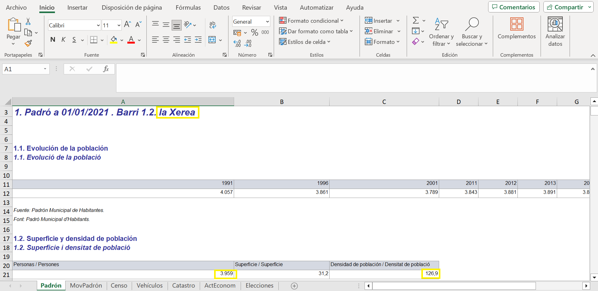

```{r setup, include=FALSE}
knitr::opts_chunk$set(echo = TRUE)
```


Hemos encontrado un dataset del Ayuntamiento de Valencia del año 2022, el cuan los proporcionará información más fiable relacionada con la densidad de población y el área de cada barrio.

Este *dataset* se trata de un directorio donde se encuentran un total de 176 archivos Excel. Dos de estos aportan información relacionada con Valencia, mientras que el resto dan información específica de cada barrio (por cada barrio hay dos archivos, uno en castellano y otro en valenciano). Por tanto, hemos creado un programa que abra uno a uno los archivos en un idioma y obtenga la información que deseamos para despuer guardarla en un datagrame.

Para ello, primero hemos abierto uno de los archivos Excel (ver Figura 1) y se ha estudiado como abordar el problema. Después, se ha cargado  uno de ellos, y se ha buscado la manera de obtener la información referida al nombre del barrio, el área y la población del mismo (recuadros amarillos en la Figura 1). 
{withd="80%"}
*Figuara 1: ejemplo de uno de los archivos Excel analizados.*


```{r eval=FALSE, include=TRUE}
#   SE HA PUESTO CON eval = FALSE PORQUE TARDA MUCHO EN CORRERSE

# Obtener las rutas de todos los archivos con los que se va a trabajar
archivos_barrios <- list.files(path = "./ProyectoAED2023/data/Barrios2022", pattern = 'Districte', full.names = TRUE)

# Creamos las listas donde vamos a guardar los datos de interés (la longitud es de 87 porque hay información sobre 87 barrios)
area <- 1:87
poblacion <- 1:87
nombre <- 1:87

library(readxl)
library(stringr)
# Un bucle que recorre todos los archivos que utilizaremos y extrae los datos de interés
for (i in 1:length(archivos_barrios)) {
  Barrio <- read_excel(archivos_barrios[i], sheet = "Padrón")
  fila <- grep('Padró' ,Barrio[[1]])[1]
  nombre_barrio <- Barrio[[1]][fila]
  nombre[i] <-trimws(toupper(substring(nombre_barrio, 36)))
  fila <- grep('Superficie' ,Barrio$...2)
  area[i] <- Barrio$...2[fila + 1]
  fila <- grep('Personas', Barrio[[1]])[1]
  poblacion[i] <- Barrio[[1]][fila + 1]
}
demografico <- data.frame(nombre, area, poblacion)


# Hay algunos nombres que se han guardado mal, por lo que vamos a tener que tratarlos. Vemos que todos los que estan mal comienzan por ".  " o por "[0-9].  "

for (i in 1:length(demografico$nombre)) {
  if (grepl('^[^A-Za-z]',demografico$nombre)[i]) {
    demografico$nombre[i] <- str_remove(demografico$nombre[i], "([0-9]|). ")
  }
}


# También falta el dato de un barrio, asi que hay una fila de más
demografico <- demografico[!(demografico$nombre == '88'), ]

# Vemos quales de los nombres del dataframe nuevo no están en el principal
df$Barrio[!(demografico$nombre %in% df$Barrio)]

# Hay que poner de la misma maera que estan en el data-frame pricipal
demografico$nombre[demografico$nombre == "GRAN VIA"] <- "LA GRAN VIA"
demografico$nombre[demografico$nombre == "EXPOSICIÓ"] <- "EXPOSICIO"
demografico$nombre[demografico$nombre == "CIUTAT UNIVERSITÀRIA"] <- "CIUTAT UNIVERSITARIA"
demografico$nombre[demografico$nombre == "SANT MARCEL·LÍ"] <- "SANT MARCEL.LI"
demografico$nombre[demografico$nombre == "CAMÍ REAL"] <- "CAMI REAL"
demografico$nombre[demografico$nombre == "MONT-OLIVET"] <- "MONTOLIVET"
demografico$nombre[demografico$nombre == "FONTETA DE SANT LLUÍS"] <- "LA FONTETA S.LLUIS"
demografico$nombre[demografico$nombre == "CIUTAT DE LES ARTS I DE LES CIÈNCIES"] <- "CIUTAT DE LES ARTS I DE LES CIENCIES"
demografico$nombre[demografico$nombre == "EL CABANYAL- EL CANYAMELAR"] <- "CABANYAL-CANYAMELAR"
demografico$nombre[demografico$nombre == "EL BOTÀNIC"] <- "EL BOTANIC"
demografico$nombre[demografico$nombre == "BETERÓ"] <- "BETERO"
demografico$nombre[demografico$nombre == "CAMÍ FONDO"] <- "CAMI FONDO"
demografico$nombre[demografico$nombre == "CIUTAT JARDÍ"] <- "CIUTAT JARDI"
demografico$nombre[demografico$nombre == "LA BEGA BAIXA"] <- "LA VEGA BAIXA"
demografico$nombre[demografico$nombre == "CAMÍ DE VERA"] <- "CAMI DE VERA"
demografico$nombre[demografico$nombre == "ORRIOLS"] <- "ELS ORRIOLS"
demografico$nombre[demografico$nombre == "SANT LLORENÇ"] <- "SANT LLORENS"
demografico$nombre[demografico$nombre == "CASES DE BÀRCENA"] <- "LES CASES DE BARCENA"
demografico$nombre[demografico$nombre == "MAUELLA"] <- "MAHUELLA-TAULADELLA"
demografico$nombre[demografico$nombre == "\t\nBORBOTO"] <- "BORBOTO"
demografico$nombre[demografico$nombre == "\t\nBENIMAMET"] <- "BENIMAMET"
demografico$nombre[demografico$nombre == "EL CASTELLAR-L'OLIVERAR"] <- "CASTELLAR-L'OLIVERAL"

# Guardar el RData
save(demografico, file = "./ProyectoAED2023/data/demografico.RData")
```

